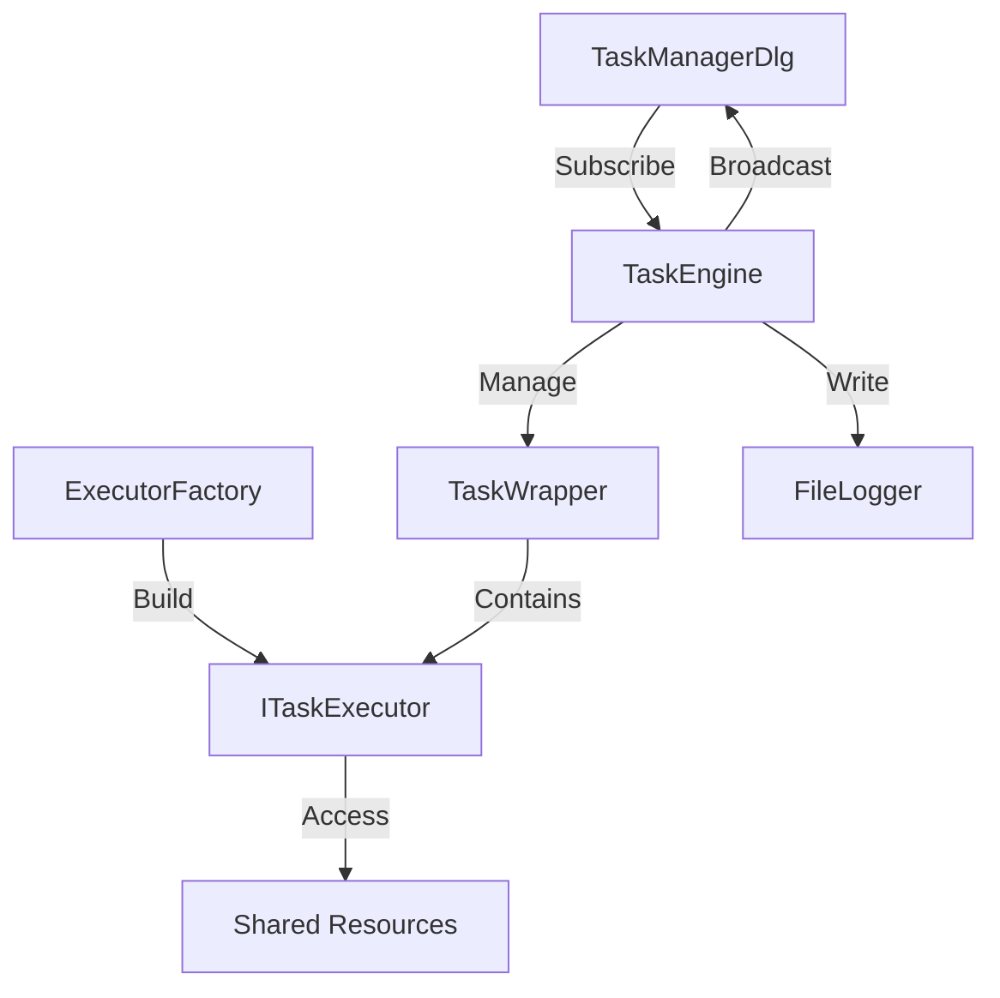

# TaskManager - 轻量级多任务调度管理器

<div align="center">


一个基于MFC对话框的多任务调度系统，演示了工厂模式、观察者模式、命令模式和RAII资源管理等设计模式的实际应用。

</div>

---

## 📋 目录

- [项目简介](#项目简介)
- [核心特性](#核心特性)
- [系统架构](#系统架构)
- [环境要求](#环境要求)
- [快速开始](#快速开始)
- [功能说明](#功能说明)
- [设计模式](#设计模式)
- [死锁演示](#死锁演示)
- [文件结构](#文件结构)
- [技术亮点](#技术亮点)
- [常见问题](#常见问题)
- [开发计划](#开发计划)
- [贡献指南](#贡献指南)
- [许可证](#许可证)

---

## 🎯 项目简介

**TaskManager** 是一个基于 MFC（Microsoft Foundation Classes）开发的 Windows 桌面应用程序，实现了轻量级的多任务调度引擎。项目旨在展示：

- ✅ 如何使用现代C++特性（智能指针、lambda、原子操作）改造传统MFC应用
- ✅ 多线程编程中的同步机制（互斥锁、条件变量）
- ✅ RAII（Resource Acquisition Is Initialization）资源管理模式
- ✅ 经典设计模式在实际项目中的应用
- ✅ 死锁问题的产生与预防方案

---

## ⚡ 核心特性

### 1️⃣ 多任务调度引擎
- **优先级队列调度**：基于时间戳的最小堆实现
- **延迟执行**：支持毫秒级精确延迟
- **周期任务**：支持按固定间隔重复执行
- **异常安全**：任务执行失败不影响调度器运行

### 2️⃣ 五大基础任务
| 任务名称 | 功能描述 | 执行模式 |
|---------|---------|---------|
| **矩阵计算** | 模拟200×200矩阵乘法运算 | 周期（5秒） |
| **数据备份** | 使用PowerShell压缩指定目录 | 延迟（3秒） |
| **网络请求** | 模拟HTTP GET请求 | 立即执行 |
| **提醒服务** | 弹窗提醒系统消息 | 周期（60秒） |
| **统计分析** | 随机数生成与统计计算 | 立即执行 |

### 3️⃣ 死锁演示系统
- **资源竞争模拟**：双锁交叉场景（Lock A→B vs Lock B→A）
- **崩溃恢复测试**：异常抛出时的锁释放验证
- **RAII对比**：手动lock与智能lock的安全性对比

### 4️⃣ 实时监控面板
- **日志流展示**：实时显示任务执行状态
- **结果可视化**：独立显示矩阵/网络/统计任务的输出
- **异常追踪**：捕获并记录所有运行时错误

---

## 🏗️ 系统架构

### 三层架构设计

```
┌─────────────────────────────────────────────┐
│          Presentation Layer (UI)            │
│  ┌─────────────────────────────────────┐   │
│  │   TaskManagerDlg (MFC Dialog)       │   │
│  │   - 控件事件处理                     │   │
│  │   - 实时日志显示                     │   │
│  │   - 结果数据绑定                     │   │
│  └─────────────────────────────────────┘   │
└─────────────────┬───────────────────────────┘
                  │ IMessageReceiver (观察者)
┌─────────────────▼───────────────────────────┐
│          Business Logic Layer               │
│  ┌─────────────────────────────────────┐   │
│  │   TaskEngine (单例调度器)            │   │
│  │   - 优先队列管理                     │   │
│  │   - 线程池调度                       │   │
│  │   - 异常捕获                         │   │
│  └─────────────────────────────────────┘   │
│  ┌─────────────────────────────────────┐   │
│  │   ExecutorFactory (工厂模式)        │   │
│  └─────────────────────────────────────┘   │
└─────────────────┬───────────────────────────┘
                  │ ITaskExecutor (策略接口)
┌─────────────────▼───────────────────────────┐
│          Task Execution Layer               │
│  ┌──────────┐  ┌──────────┐  ┌──────────┐ │
│  │ Matrix   │  │ Backup   │  │ Web      │ │
│  │ Executor │  │ Executor │  │ Executor │ │
│  └──────────┘  └──────────┘  └──────────┘ │
│  ┌──────────┐  ┌──────────┐               │
│  │ Alert    │  │ Analytics│               │
│  │ Executor │  │ Executor │               │
│  └──────────┘  └──────────┘               │
└─────────────────────────────────────────────┘
```

### 核心组件关系



---

## 💻 环境要求

### 硬件要求
- **处理器**：Intel Core i3 或更高
- **内存**：4GB RAM 或更高
- **硬盘**：100MB 可用空间

### 软件要求
| 组件 | 版本要求 |
|------|---------|
| 操作系统 | Windows 10 (1903+) / Windows 11 |
| 开发工具 | Visual Studio 2022 (17.0+) |
| MFC库 | MFC 14.x (VS2022自带) |
| C++标准 | C++17 或更高 |
| .NET Framework | 4.8+ (用于部分系统调用) |

### 可选组件
- PowerShell 5.1+ (用于文件备份功能)
- Internet连接 (用于网络请求演示)

---

## 🚀 快速开始

### 方法一：从源码构建

#### 1. 克隆仓库
```bash
git clone https://github.com/yourusername/TaskManager.git
cd TaskManager
```

#### 2. 打开解决方案
```
双击 TaskManager.sln
```

#### 3. 配置项目
- 右键项目 → **属性**
- **配置属性** → **常规**
  - 平台工具集：`Visual Studio 2022 (v143)`
  - Windows SDK版本：`10.0 (最新安装版本)`
  - 字符集：`使用Unicode字符集`

#### 4. 编译运行
```
快捷键：Ctrl + F5 (不调试启动)
或
快捷键：F5 (调试启动)
```

### 方法二：直接运行可执行文件

#### 1. 下载发行版
前往 [Releases](https://github.com/yourusername/TaskManager/releases) 页面下载最新版本

#### 2. 解压并运行
```
解压 TaskManager_v1.0.zip
双击 TaskManager.exe
```

---

## 📖 功能说明

### 系统控制面板

#### 启动引擎
- **按钮**：`启动引擎`
- **功能**：初始化调度器后台线程，开始接受任务提交
- **状态**：启动后按钮变灰，防止重复启动
- **日志**：`[Engine] 引擎已启动`

#### 停止引擎
- **按钮**：`停止引擎`
- **功能**：安全关闭调度器，等待当前任务完成后退出
- **注意**：停止后需重启程序才能再次启动
- **日志**：`[Engine] 引擎已停止`

---

### 任务执行面板

#### 1. 矩阵计算
```cpp
执行间隔：5秒
任务类型：周期任务
计算内容：200×200 随机矩阵乘法
输出示例：结果矩阵[200x200] 耗时: 0.6s
```
**业务价值**：模拟CPU密集型计算任务

#### 2. 数据备份
```powershell
执行延迟：3秒
任务类型：一次性任务
备份命令：Compress-Archive -Path C:\Data\* -DestinationPath E:\backup.zip
前置条件：C:\Data 目录存在
```
**注意事项**：
- ⚠️ 需要管理员权限（如果C盘受保护）
- ⚠️ 确保E盘有足够空间

#### 3. 网络请求
```http
执行延迟：0秒（立即）
请求方式：GET
模拟接口：内部模拟HTTP响应
输出示例：状态码: 200 OK
```
**扩展方向**：可替换为真实的WinHTTP或cURL实现

#### 4. 提醒服务
```cpp
执行间隔：60秒
任务类型：周期任务
弹窗标题：提醒服务
弹窗内容：【系统提醒】该完成今日任务了！
```
**应用场景**：番茄工作法、定时休息提醒

#### 5. 统计分析
```cpp
执行延迟：0秒
数据量：1000个随机数
范围：0-100
计算内容：算术平均值
输出示例：均值: 49.87
```
**算法复杂度**：O(n)

---

### 死锁演示面板

#### 场景一：模拟资源竞争
**执行流程**：
```
1. [Deadlock] 线程A: 获取资源A (成功)
2. [Deadlock] 线程A: 等待资源B...
3. [模拟] 线程B同时持有B等待A (实际未实现第二线程)
4. [Deadlock] 线程A: 发生致命错误 → 崩溃
5. ❌ 资源A和B未释放
6. [Validator] 验证线程: 尝试获取资源A... (阻塞)
```

#### 场景二：安全资源管理
**执行流程**：
```
1. [Safe] 线程B: 使用RAII获取资源A (std::unique_lock)
2. [Safe] 线程B: 使用RAII获取资源B (std::unique_lock)
3. [Safe] 线程B: 模拟异常 → throw
4. ✅ RAII自动释放资源A和B
5. [Validator] 验证线程: 成功获取资源A
6. [Validator] ✅ 验证通过：RAII机制有效防止死锁！
```

**对比总结**：

| 特性 | 手动lock | RAII (unique_lock) |
|------|---------|-------------------|
| 异常安全 | ❌ 崩溃时锁不释放 | ✅ 自动释放 |
| 代码可读性 | ⚠️ 需手动配对unlock | ✅ 作用域自动管理 |
| 死锁风险 | ⚠️ 高 | ✅ 低 |
| 调试难度 | ⚠️ 困难 | ✅ 容易 |

---

## 🎨 设计模式

### 1. 单例模式 (Singleton)

**实现位置**：`TaskEngine`

```cpp
class TaskEngine {
private:
    static TaskEngine* instance;
    TaskEngine();  // 私有构造
    
public:
    static TaskEngine* Instance() {
        if (instance == nullptr) {
            instance = new TaskEngine();
        }
        return instance;
    }
};
```

**优势**：
- ✅ 保证全局唯一调度器实例
- ✅ 避免多线程重复创建资源
- ✅ 提供全局访问点

**线程安全改进建议**：
```cpp
// 使用std::call_once确保线程安全
static std::once_flag initFlag;
static TaskEngine* Instance() {
    std::call_once(initFlag, []() {
        instance = new TaskEngine();
    });
    return instance;
}
```

---

### 2. 工厂模式 (Factory)

**实现位置**：`ExecutorFactory`

```cpp
class ExecutorFactory {
public:
    static std::shared_ptr<ITaskExecutor> Build(const std::string& type) {
        if (type == "Matrix") return std::make_shared<MatrixExecutor>();
        if (type == "Backup") return std::make_shared<BackupExecutor>();
        // ...
        return nullptr;
    }
};
```

**优势**：
- ✅ 解耦对象创建和使用
- ✅ 便于扩展新任务类型
- ✅ 统一管理对象生命周期

**扩展示例**：
```cpp
// 添加新任务只需两步
// 1. 实现ITaskExecutor接口
class EmailExecutor : public ITaskExecutor {
    std::string GetID() const override { return "Email"; }
    void Run() override { /* 发送邮件逻辑 */ }
};

// 2. 在工厂中注册
if (type == "Email") return std::make_shared<EmailExecutor>();
```

---

### 3. 观察者模式 (Observer)

**实现位置**：`IMessageReceiver` + `TaskEngine`

```cpp
// 观察者接口
class IMessageReceiver {
public:
    virtual void OnMessageArrived(const std::string& msg) = 0;
};

// 被观察者(主题)
class TaskEngine {
    std::vector<IMessageReceiver*> receivers;
    
    void Broadcast(const std::string& msg) {
        for (auto r : receivers) {
            if (r) r->OnMessageArrived(msg);
        }
    }
};
```

**数据流动**：
```
TaskEngine (后台线程)
    ↓ Broadcast("[Running] Matrix Calc")
IMessageReceiver::OnMessageArrived
    ↓ PostMessage(WM_LOG_UPDATE)
TaskManagerDlg::OnLogUpdate (主线程)
    ↓ 更新ListBox控件
```

**优势**：
- ✅ UI与业务逻辑解耦
- ✅ 支持多个观察者
- ✅ 避免跨线程直接操作UI

---

### 4. 策略模式 (Strategy)

**实现位置**：`ITaskExecutor`接口

```cpp
class ITaskExecutor {
public:
    virtual void Run() = 0;  // 不同任务有不同执行策略
};

// 矩阵计算策略
class MatrixExecutor : public ITaskExecutor {
    void Run() override {
        // CPU密集型计算
    }
};

// 网络请求策略
class WebExecutor : public ITaskExecutor {
    void Run() override {
        // I/O密集型操作
    }
};
```

**优势**：
- ✅ 运行时动态切换算法
- ✅ 避免大量if-else分支
- ✅ 符合开闭原则

---

### 5. 命令模式 (Command)

**实现位置**：`TaskWrapper`

```cpp
struct TaskWrapper {
    std::shared_ptr<ITaskExecutor> executor;  // 封装接收者
    std::chrono::system_clock::time_point triggerTime;  // 参数
    bool isRepeating;
    // ...
};
```

**优势**：
- ✅ 将请求封装为对象
- ✅ 支持参数化操作（延迟、周期）
- ✅ 便于实现撤销/重做（本项目未实现）

---

## 🔐 死锁演示

### 什么是死锁？

**定义**：两个或多个线程互相等待对方持有的资源，导致所有线程无限期阻塞。

**经典案例（哲学家就餐问题）**：
```
5位哲学家围坐圆桌，每人需要左右两把叉子才能吃饭
如果每人同时拿起右手边的叉子，再等待左手边的叉子
→ 所有人都拿着一把叉子，永远等待另一把 → 死锁
```

### 本项目的死锁场景

#### 场景设计：双锁交叉

```cpp
// 线程A的执行顺序
void DeadlockDemoExecutor::Run() {
    g_sharedResource_A.lock();  // 1. 获取资源A
    Sleep(100);                 // 2. 模拟处理时间
    g_sharedResource_B.lock();  // 3. 尝试获取资源B (假设此时B被线程B持有)
    
    // 如果存在线程B：
    // B.lock(资源B) → B.等待(资源A) → A.等待(资源B)
    // → 死锁
    
    throw std::runtime_error("Crash");  // 4. 崩溃，锁未释放
}
```

### RAII如何解决问题？

#### 智能锁的原理

```cpp
void SafeDemoExecutor::Run() {
    std::unique_lock<std::mutex> lockA(g_sharedResource_A);  // RAII管理
    // lockA在构造时自动调用 mutex.lock()
    
    Sleep(100);
    
    std::unique_lock<std::mutex> lockB(g_sharedResource_B);
    
    throw std::runtime_error("Crash");  // 抛出异常
    
    // 函数退出时，lockB和lockA按后进先出顺序析构
    // lockB析构 → mutex_B.unlock()
    // lockA析构 → mutex_A.unlock()
    // 资源被正确释放！
}
```

#### 栈展开过程

```
1. throw异常 → 开始栈展开(Stack Unwinding)
2. 销毁lockB对象 → 调用~unique_lock() → mutex_B.unlock()
3. 销毁lockA对象 → 调用~unique_lock() → mutex_A.unlock()
4. 异常被catch捕获
5. 验证线程可以正常获取资源A
```

### 验证流程

#### 死锁演示
```
点击按钮 → 提交两个任务：
1. DeadlockDemo (100ms后执行)
2. Validator (3000ms后执行)

结果：
- Validator线程被阻塞（资源A未释放）
- 监控窗口显示：[Validator] 等待资源A释放...
- 程序不会弹出验证成功对话框
```

#### 安全演示
```
点击按钮 → 提交两个任务：
1. SafeDemo (100ms后执行)
2. Validator (3000ms后执行)

结果：
- Validator线程成功获取资源A
- 监控窗口显示：[Validator] ✅ 成功获取资源A！
- 弹出对话框：✅ 防死锁演示成功！
```

---

## 📁 文件结构

```
TaskManager/
├── 📄 TaskManager.sln              # Visual Studio解决方案文件
├── 📄 TaskManager.vcxproj          # 项目配置文件
├── 📄 TaskManager.vcxproj.filters  # 文件过滤器
│
├── 📂 Source Files/                # 源文件
│   ├── TaskManager.cpp             # 应用程序入口
│   ├── TaskManagerDlg.cpp          # 主对话框实现
│   ├── TaskEngine.cpp              # 调度引擎实现
│   ├── ExecutorFactory.cpp         # 工厂实现
│   ├── pch.cpp                     # 预编译头
│   └── ...
│
├── 📂 Header Files/                # 头文件
│   ├── TaskManager.h               # 应用类声明
│   ├── TaskManagerDlg.h            # 对话框类声明
│   ├── TaskEngine.h                # 调度引擎声明
│   ├── ITaskExecutor.h             # 任务接口
│   ├── IMessageReceiver.h          # 观察者接口
│   ├── FileLogger.h                # 日志器
│   ├── TaskWrapper.h               # 任务包装器
│   ├── ExecutorFactory.h           # 工厂声明
│   ├── ConcreteExecutors.h         # 具体任务实现
│   ├── framework.h                 # MFC框架
│   ├── targetver.h                 # SDK版本
│   ├── Resource.h                  # 资源ID定义
│   └── pch.h                       # 预编译头
│
├── 📂 Resource Files/              # 资源文件
│   ├── TaskManager.rc              # 资源脚本
│   └── TaskManager.rc2             # 自定义资源
│
├── 📂 res/                         # 资源目录
│   ├── TaskManager.ico             # 应用图标
│   └── ...
│
├── 📂 Debug/                       # 调试输出 (自动生成)
│   ├── TaskManager.exe             # 可执行文件
│   ├── engine_log.txt              # 运行日志
│   └── ...
│
├── 📂 Release/                     # 发布输出 (自动生成)
│   └── TaskManager.exe
│
├── 📄 README.md                    # 本文档
├── 📄 LICENSE                      # 许可证
└── 📄 .gitignore                   # Git忽略规则
```

---

## 💡 技术亮点

### 1. 线程安全的优先队列

#### 问题
`std::priority_queue` 不是线程安全的，多线程同时访问会导致数据竞争。

#### 解决方案
```cpp
class TaskEngine {
    std::priority_queue<TaskWrapper, ...> taskQueue;
    std::mutex queueMutex;
    std::condition_variable cvQueue;
    
    void SubmitTask(...) {
        std::lock_guard<std::mutex> lock(queueMutex);  // RAII锁
        taskQueue.push(wrapper);
        cvQueue.notify_one();  // 唤醒工作线程
    }
};
```

**关键技术**：
- ✅ `std::mutex`：互斥锁保护共享数据
- ✅ `std::lock_guard`：自动加锁解锁
- ✅ `std::condition_variable`：线程同步通信

---

### 2. 高精度定时器

#### 问题
任务需要在指定时间点精确触发，`Sleep()`不够灵活。

#### 解决方案
```cpp
void TaskEngine::EngineLoop() {
    std::unique_lock<std::mutex> lock(queueMutex);
    
    const auto& top = taskQueue.top();
    
    if (now >= top.triggerTime) {
        // 时间到了，立即执行
    } else {
        // 使用条件变量等待到指定时间
        cvQueue.wait_until(lock, top.triggerTime);
    }
}
```

**优势**：
- ✅ 毫秒级精度
- ✅ 可被新任务唤醒（提前返回）
- ✅ 避免忙等待（CPU友好）

---

### 3. 跨线程UI更新

#### 问题
MFC控件只能在创建它的线程（UI线程）中访问，后台线程直接操作会崩溃。

#### 解决方案
```cpp
// 后台线程
void TaskEngine::Broadcast(const std::string& msg) {
    for (auto r : receivers) {
        r->OnMessageArrived(msg);  // 调用观察者
    }
}

// 观察者实现
void TaskManagerDlg::OnMessageArrived(const std::string& msg) {
    std::string* pMsg = new std::string(msg);
    PostMessage(WM_LOG_UPDATE, 0, (LPARAM)pMsg);  // 投递到UI线程
}

// UI线程处理
LRESULT TaskManagerDlg::OnLogUpdate(WPARAM wParam, LPARAM lParam) {
    std::string* pMsg = (std::string*)lParam;
    // 安全更新ListBox
    pList->AddString(CA2T(pMsg->c_str()));
    delete pMsg;  // 释放内存
    return 0;
}
```

**关键技术**：
- ✅ `PostMessage`：异步消息传递
- ✅ 自定义消息ID：`WM_USER + 200`
- ✅ 堆内存传递：避免栈数据失效

---

### 4. 异常安全保证

#### 基本保证
```cpp
void TaskEngine::EngineLoop() {
    try {
        executor->Run();
    } catch (const std::exception& e) {
        logger.Log("[Error] " + executor->GetID() + ": " + e.what());
        // 任务失败，但引擎继续运行
    }
}
```

#### 强保证（RAII）
```cpp
class FileLogger {
    std::ofstream file;
    
public:
    FileLogger(const std::string& path) {
        file.open(path, std::ios::app);
        if (!file) throw std::runtime_error("Cannot open log file");
    }
    
    ~FileLogger() {
        if (file.is_open()) file.close();  // 保证文件关闭
    }
};
```

---

### 5. 智能指针管理生命周期

#### 问题
原始指针容易导致内存泄漏和悬空指针。

#### 解决方案
```cpp
// 使用shared_ptr共享所有权
std::shared_ptr<ITaskExecutor> executor = ExecutorFactory::Build("Matrix");

// 任务可以被多个TaskWrapper引用
TaskWrapper wrapper1(executor, time1, false, 0);
TaskWrapper wrapper2(executor, time2, true, 5000);

// 当最后一个wrapper销毁时，executor自动释放
```

**优势**：
- ✅ 自动内存管理
- ✅ 引用计数跟踪
- ✅ 线程安全（原子操作）

---

## ❓ 常见问题

### Q1: 编译时报错 "无法打开pch.h"
**A**: 右键项目 → 属性 → C/C++ → 预编译头 → 选择"使用(/Yu)"

---

### Q2: 运行时提示 "MSVCP140.dll丢失"
**A**: 安装 [Visual C++ Redistributable](https://aka.ms/vs/17/release/vc_redist.x64.exe)

---

### Q3: 备份任务失败，提示"拒绝访问"
**A**: 
1. 以管理员身份运行程序
2. 确保 `C:\Data` 目录存在且有读取权限
3. 确保 `E:\` 盘有写入权限

---

### Q4: 死锁演示看不到效果
**A**: 
1. 确保先点击"启动引擎"
2. 点击"模拟资源竞争"后等待3秒
3. 查看监控窗口是否显示 `[Validator] 等待资源A释放...`

---

### Q5: 如何添加新任务类型？

**步骤**：
```cpp
// 1. 在ConcreteExecutors.h中添加新类
class CustomExecutor : public ITaskExecutor {
public:
    std::string GetID() const override { return "Custom Task"; }
    
    void Run() override {
        // 你的业务逻辑
        TaskEngine::Instance()->GetLogger().Log("[Custom] Running...");
    }
};

// 2. 在ExecutorFactory::Build中注册
if (type == "Custom") return std::make_shared<CustomExecutor>();

// 3. 在对话框中添加按钮
void CTaskManagerDlg::OnBnClickedBtnCustom() {
    auto task = ExecutorFactory::Build("Custom");
    TaskEngine::Instance()->SubmitTask(task, 0);
}

// 4. 在资源编辑器中创建按钮并绑定事件
```

---

### Q6: 如何查看详细日志？
**A**: 日志文件位置：
```
Debug模式：项目目录\Debug\engine_log.txt
Release模式：项目目录\Release\engine_log.txt
```

---

### Q7: 程序崩溃怎么调试？
**A**: 
1. 按 `F5` 以调试模式运行
2. 崩溃时VS会自动断点到异常位置
3. 查看"调用堆栈"窗口追踪函数调用链
4. 检查"局部变量"窗口查看变量状态

---

## 🗓️ 开发计划

### 版本 1.1 (计划中)
- [ ] 添加任务优先级设置
- [ ] 支持任务取消功能
- [ ] 实现任务依赖关系（Task A完成后再执行Task B）
- [ ] 添加任务执行历史记录查询

### 版本 1.2 (计划中)
- [ ] 支持任务配置文件（JSON/XML）
- [ ] 添加任务执行统计图表（CPU/内存占用）
- [ ] 实现任务分组管理
- [ ] 支持自定义日志级别（DEBUG/INFO/WARN/ERROR）

### 版本 2.0 (远期规划)
- [ ] 迁移到跨平台框架（Qt/wxWidgets）
- [ ] 支持分布式任务调度
- [ ] 添加Web管理界面
- [ ] 实现插件系统（动态加载DLL）

---

## 🤝 贡献指南

欢迎贡献代码！请遵循以下步骤：

### 1. Fork 本仓库

### 2. 创建特性分支
```bash
git checkout -b feature/AmazingFeature
```

### 3. 提交更改
```bash
git commit -m "Add some AmazingFeature"
```

### 4. 推送到分支
```bash
git push origin feature/AmazingFeature
```

### 5. 创建 Pull Request

### 代码规范
- 使用4空格缩进
- 类名使用大驼峰（PascalCase）
- 函数名使用大驼峰
- 变量名使用小驼峰（camelCase）
- 添加必要的注释
- 提交前运行代码格式化工具

---

## 📜 许可证

本项目采用 MIT 许可证 - 查看 [LICENSE](LICENSE) 文件了解详情

```
MIT License

Copyright (c) 2025 [Your Name]

Permission is hereby granted, free of charge, to any person obtaining a copy
of this software and associated documentation files (the "Software"), to deal
in the Software without restriction, including without limitation the rights
to use, copy, modify, merge, publish, distribute, sublicense, and/or sell
copies of the Software...
```


## 📊 项目统计


**总代码行数**：约 2000+ 行  
**开发周期**：2周  
**最后更新**：2025-12-28

---

<div align="center">

### ⭐ 如果这个项目对你有帮助，请给个星标！⭐

**Made with ❤️ by [Your Name]**

</div>
